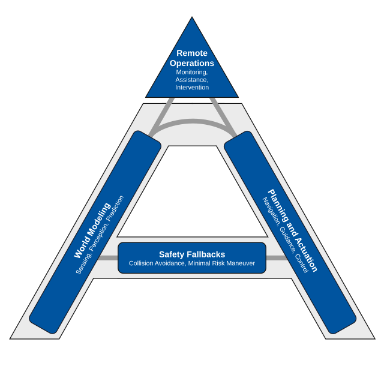

# OpenAD**Stack**

<p align="center">
  <a href="https://github.com/openads-project"></a>
  <a href="https://www.ros.org"></a>
  <a href="https://github.com/openads-project/openadstack/releases/latest"></a>
  <a href="https://github.com/openads-project/openadstack/blob/main/LICENSE"></a>
</p>

**Baseline reference implementation for modular ROS 2 automated-driving stacks in OpenADS.**

OpenADStack bundles reusable OpenADServices into a Docker Compose based reference stack. It supports different deployment compositions, from real-world automated-driving research with the [karl. research vehicle](https://karl.ac/) to lightweight and repeatable simulation tests in [OpenADSim](https://openads-project.github.io/openadsim/openadsim.html).

**🚀 [Quick Start](#-quick-start)** | **🏗️ [Architecture](#-architecture)** | **📝 [Documentation](#-documentation)** | **🙏 [Acknowledgements](#-acknowledgements)**

> [!NOTE]
> This repository is part of [***OpenADS***](https://github.com/openads-project), the *Open Automated Driving Systems* project. *OpenADS* and its modules have been initiated and are currently being maintained by the [**Institute for Automotive Engineering (ika) at RWTH Aachen University**](https://www.ika.rwth-aachen.de/de/).

<div align="center">
  <video controls autoplay width="720" src="https://github.com/user-attachments/assets/af4f9095-960a-43c5-a959-af4afa81243c"></video>
  <br>
  <em>Watch the preview above or <a href="https://www.youtube.com/watch?v=B0Lnu-1w9KE">open the full video on YouTube</a>.</em>
</div>

## 🚀 Quick Start

> [!NOTE]
> For closed-loop simulation, scenario execution, maps, and simulator adapters, [OpenADSim](https://openads-project.github.io/openadsim/openadsim.html) is the recommended entry point.

> [!IMPORTANT]
> Make sure that the general [OpenADS system requirements](https://openads-project.github.io/start/start.html#requirements) are fulfilled.

OpenADStack is usually part of a larger deployment composition, for example with the [karl. research vehicle](https://karl.ac/) or in an [OpenADSim simulation setup](https://openads-project.github.io/openadsim/openadsim.html). For a first look at OpenADStack itself, a demo is provided in this repository. It runs the stack open-loop on recorded ROS 2 data, so you can inspect the stack behavior without starting additional simulation or vehicle components.

- Two demos using different parts of OpenADStack are provided:
  - **Basic Demo** without Perception: Start the open-loop demo using recorded detections:

    ```bash
    cd demo
    docker compose up -d
    ```

  - **Extended Demo:** Start the open-loop demo including perception OpenADServices running on recorded raw sensor data:

    ```bash
    cd demo
    export COMPOSE_PROFILES=demo-extended && docker compose up -d
    ```

> [!NOTE]
> The extended demo requires an NVIDIA GPU with compute capability 8.0 or higher, and additional disk
> space of 14GB for its larger bag files.

- **Stop** the demo with:

  ```bash
  docker compose down
  ```

## 🏗️ Architecture

OpenADStack is an L4 automated driving software stack built on ROS 2. It aims to enable suitably equipped vehicles to operate in traffic without human intervention.

The system is composed of services that primarily communicate through ROS messages. Each service uses a Docker image containing one or more ROS nodes. The services are composed and deployed using Docker Compose.

The modular architecture is organized into domains such as localization, perception, planning, and control.

The architecture is documented from three complementary perspectives:

- The [**Functional Architecture**](./docs/functional-architecture.md) describes the system's functional modules, their responsibilities, and the interfaces between them.
- The [**Integration Architecture**](./docs/integration-architecture.md) explains how released OpenADServices are assembled into the reference stack.
- The [**Deployment Composition**](./docs/deployment-composition.md) describes how the stack or selected parts can be embedded in custom vehicle and simulation setups.

The following image shows the so-called *A Model*, a functional reference architecture for automated driving systems originally developed in the [UNICARagil project](http://www.unicaragil.de/en/). The left side of the A describes the world modeling while the right side describes planning and actuation. The horizontal bar describes safety fallbacks, e.g. to perform a minimum risk maneuver in case of a degradation in the higher levels. The on-board system is supported by remote operations, e.g. for technical supervision.

<div align="center" style="text-align: center;">



</div>

## 📝 Documentation

The documentation contains:

- [Getting Started](./docs/getting-started.md)
- [Functional Architecture](./docs/functional-architecture.md)
- [Integration Architecture](./docs/integration-architecture.md)
- [Deployment Composition](./docs/deployment-composition.md)

## 🙏 Acknowledgements

### Citation

We hope that OpenADStack can help your research. If this is the case, please cite it using the metadata specified in [CITATION.cff](https://github.com/openads-project/openadstack/blob/main/CITATION.cff), or click on Cite this repository in GitHub's About section on the top right.

### Related Publications

<details>

<summary><strong>karl. - A Research Vehicle for Automated and Connected Driving, 2026</strong></summary>

> *([IEEEXplore](https://ieeexplore.ieee.org/document/10588502), [arXiv](http://arxiv.org/abs/2404.01836), [ResearchGate](https://www.researchgate.net/publication/379484629_CARLOS_An_Open_Modular_and_Scalable_Simulation_Framework_for_the_Development_and_Testing_of_Software_for_C-ITS))*  
>
> Jean-Pierre Busch, Lukas Ostendorf, Guido Linden, Lennart Reiher, Till Beemelmanns, Bastian Lampe, Timo Woopen, Lutz Eckstein
> [Institute for Automotive Engineering (ika), RWTH Aachen University](https://www.ika.rwth-aachen.de/en/)
>
> <sup>*Abstract* – As highly automated driving is transitioning from single-vehicle closed-access testing to commercial deployments of public ride-hailing in selected areas (e.g., Waymo), automated driving and connected cooperative intelligent transport systems (C-ITS) remain active fields of research. Even though simulation is omnipresent in the development and validation life cycle of automated and connected driving technology, the complex nature of public road traffic and software that masters it still requires real-world integration and testing with actual vehicles. Dedicated vehicles for research and development allow testing and validation of software and hardware components under real-world conditions early on. They also enable collecting and publishing real-world datasets that let others conduct research without vehicle access, and support early demonstration of futuristic use cases. In this paper, we present karl., our new research vehicle for automated and connected driving. Apart from major corporations, few institutions worldwide have access to their own L4-capable research vehicles, restricting their ability to carry out independent research. This paper aims to help bridge that gap by sharing the reasoning, design choices, and technical details that went into making karl. a flexible and powerful platform for research, engineering, and validation in the context of automated and connected driving. More impressions of karl. are available at [https://karl.ac/](https://karl.ac/).</sup>

</details>

### Licensing

The source code in this repository is licensed under Apache-2.0, see [LICENSE](https://github.com/openads-project/openadstack/blob/main/LICENSE). Container images provided by this repository may contain third-party software shipped with their own license terms.

### Funding

Development and maintenance of this repository are supported by the following projects. We acknowledge the funding of the respective institutions.

| Project                                          | Funding Institution                                           | Grant Number |
| ------------------------------------------------ | ------------------------------------------------------------- | ------------ |
| [6GEM+](https://6gem.de)                         | 🇩🇪 Federal Ministry for Research, Technology and Space (BMFTR) | 16KIS2409K   |
| [AIGGREGATE](https://aiggregate.eu/)             | 🇪🇺 European Union                                              | 101202457    |
| [AIthena](https://aithena.eu/)                   | 🇪🇺 European Union                                              | 101076754    |
| [autotech.agil](https://www.autotechagil.de/en/) | 🇩🇪 Federal Ministry for Research, Technology and Space (BMFTR) | 01IS22088A   |

<p>
  
  
</p>

<sup><sub>Funded by the European Union. Views and opinions expressed are however those of the author(s) only and do not necessarily reflect those of the European Union or the European Climate, Infrastructure and Environment Executive Agency (CINEA). Neither the European Union nor CINEA can be held responsible for them.</sup></sup>
