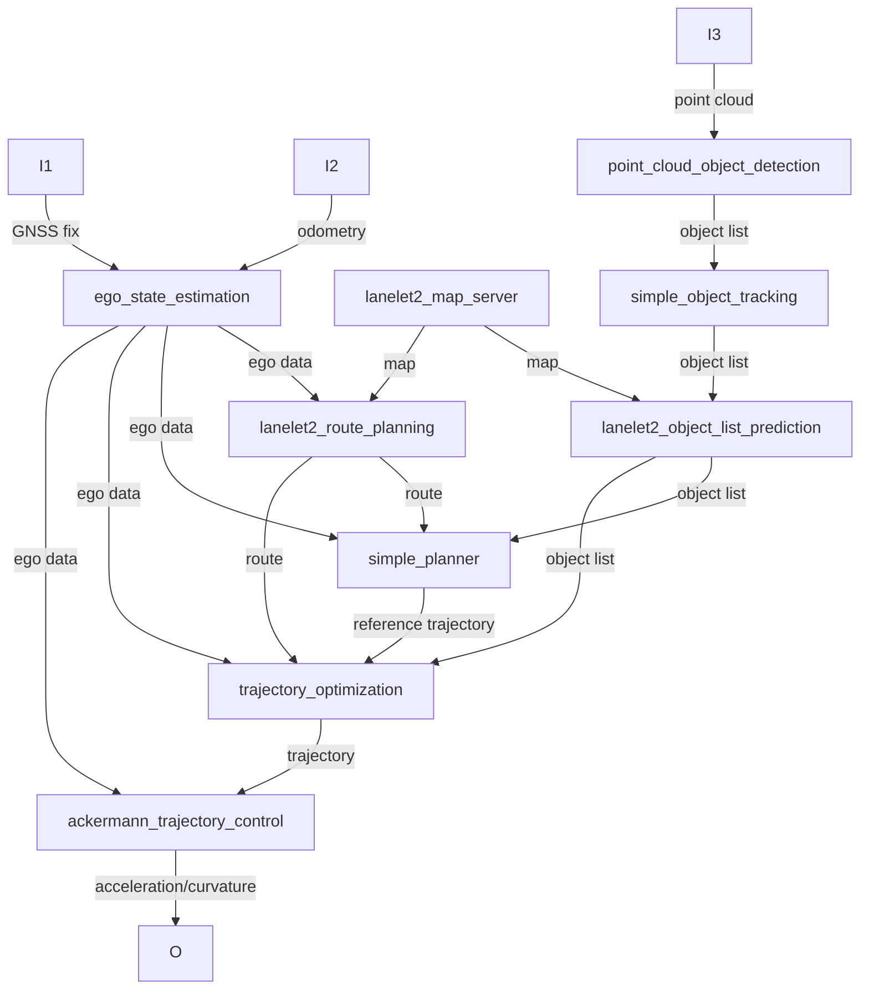

# OpenADStack

  
  

> [!IMPORTANT]
> This repository is part of [***OpenADS***](https://github.com/openads-project), the *Open Automated Driving Stack*. *OpenADS* and its modules have been initiated and are currently being maintained by the [**Institute for Automotive Engineering (ika) at RWTH Aachen University**](https://www.ika.rwth-aachen.de/de/).

