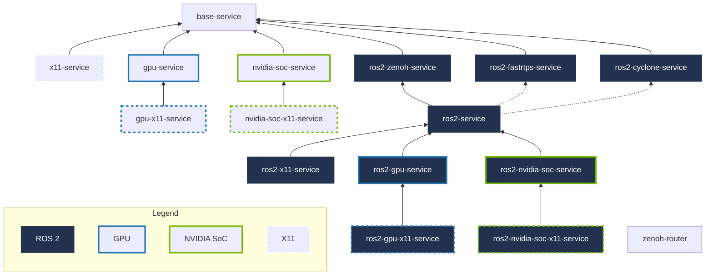

# docker-compose-essentials

TODO

| Service Template              | Description                                                  |
| :---------------------------- | :----------------------------------------------------------- |
| `base-service`                | Base service                                                 |
| `x11-service`                 | Enables X11 GUI forwarding                                   |
| `gpu-service`                 | Makes all NVIDIA GPUs available                              |
| `nvidia-soc-service`          | Makes integrated NVIDIA SoC GPU available                    |
| `gpu-x11-service`             | Enables X11 GUI forwarding for `gpu-service`                 |
| `nvidia-soc-x11-service`      | Enables X11 GUI forwarding for `nvidia-soc-service`          |
| `ros2-service`                | Base ROS 2 service with configurable RMW                     |
| `ros2-zenoh-service`          | Base ROS 2 service with RMW Zenoh                            |
| `ros2-fastrtps-service`       | Base ROS 2 service with RMW Fast RTPS                        |
| `ros2-cyclone-service`        | Base ROS 2 service with RMW Cyclone DDS                      |
| `ros2-x11-service`            | Enables X11 GUI forwarding for `ros2-service`                |
| `ros2-gpu-service`            | Makes all NVIDIA GPUs available for `ros2-service`           |
| `ros2-nvidia-soc-service`     | Makes integrated NVIDIA SoC GPU available for `ros2-service` |
| `ros2-gpu-x11-service`        | Enables X11 GUI forwarding for `ros2-gpu-service`            |
| `ros2-nvidia-soc-x11-service` | Enables X11 GUI forwarding for `ros2-nvidia-soc-service`     |
| `zenoh-router`                | Zenoh router for ROS 2 services with Zenoh RMW               |

