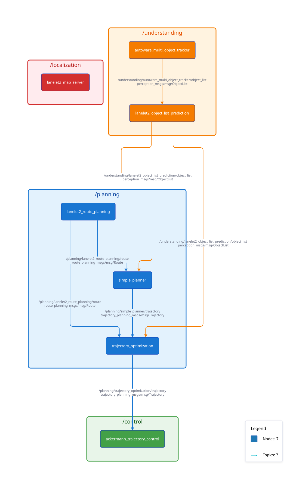

# Functional Architecture

The following image is automatically generated from the current full demo compose file. It shows the ROS nodes assigned to different namespaces and their communication topics and types.

*Click the diagram to download the full-size image for zooming.*

> [!NOTE]
> Repositories tagged with 🔗 are not hosted in the [openads-project](https://github.com/openads-project/) GitHub organization

## Interfaces

For communication between nodes, [common interfaces](https://github.com/ros2/common_interfaces) are used whenever possible. For specific automated driving messages, the following additional interface defitions are used.

| Interface Repository | Description | Teaser |
| --- | --- | --- |
| [perception_interfaces](https://github.com/ika-rwth-aachen/perception_interfaces) 🔗 | ROS packages with common messages and tools relating to the perception task in automated driving and C-ITS |  |
| [planning_interfaces](https://github.com/ika-rwth-aachen/planning_interfaces) 🔗 | ROS packages with common messages and tools relating to the behavior planning task of automated vehicles |  |
| [etsi_its_messages](https://github.com/ika-rwth-aachen/etsi_its_messages) 🔗 | ROS 2 Support for ETSI ITS Messages for V2X Communication |  |

## Functional Modules - OpenADServices

### Localization

| OpenADService | Description | Teaser |
| --- | --- | --- |
| [lanelet2_map_server](https://github.com/openads-project/lanelet2_map_server) | ROS 2 HD Map Server for Automated Driving based on Lanelet2 |  |

### Perception

| OpenADService | Description | Teaser |
| --- | --- | --- |
| [point_cloud_fusion](https://github.com/openads-project/point_cloud_fusion) | ROS 2 Point Cloud Fusion of Multiple Point Clouds into a Single Point Cloud | <video autoplay src="https://github.com/openads-project/point_cloud_fusion/raw/refs/heads/main/assets/pcl-fusion-teaser-video.mp4" width="300" style="max-width: 100%;" /> |
| [point_cloud_object_detection](https://github.com/openads-project/point_cloud_object_detection) | ROS 2 Point Cloud Object Detection for Automated Driving | <video autoplay src="https://github.com/openads-project/point_cloud_object_detection/raw/refs/heads/main/assets/pcod-teaser.mp4" width="300" style="max-width: 100%;" /> |

### Understanding

| OpenADService | Description | Teaser |
| --- | --- | --- |
| [autoware_multi_object_tracker](https://github.com/thinking-cars/autoware_multi_object_tracker) 🔗 | Modularized multi object tracker from Autoware Universe |  |
| [lanelet2_object_list_prediction](https://github.com/openads-project/lanelet2_object_list_prediction) | ROS 2 Object List Prediction for Automated Driving based on Lanelet2 |  |

### Planning

| OpenADService | Description | Teaser |
| --- | --- | --- |
| [lanelet2_route_planning](https://github.com/openads-project/lanelet2_route_planning) | ROS 2 Route Planning for Automated Driving based on Lanelet2 |  |
| [simple_planner](https://github.com/openads-project/simple_planner) | ROS 2 Reference Trajectory Planning for Automated Driving |  |
| [trajectory_optimization](https://github.com/openads-project/trajectory_optimization) | ROS 2 Trajectory Optimization for Automated Driving based on an Optimal Control Problem (OCP) |  |

### Control

| OpenADService | Description | Teaser |
| --- | --- | --- |
| [ackermann_trajectory_control](https://github.com/openads-project/ackermann_trajectory_control) | ROS 2 Route Planning for Automated Driving based on Lanelet2 | - |
