# Integration Architecture

OpenADStack integrates independently released OpenADServices into a reusable automated-driving stack. It defines how the OpenADServices are connected, but does not contain their source code or define a deployment composition. Source-level OpenADService development and the definition of deployment compositions remain separate concerns.

## Architectural Principles

- **ROS 2 provides the communication interfaces between OpenADServices**. Well-defined topics, ROS 2 services, and actions define explicit OpenADService boundaries.
- **Docker Compose defines the runtime orchestration**. It combines the independently released OpenADService images, applies environment variables, declares runtime dependencies, and selects required resources such as GPU or X11 access.
- **OpenADStack assigns consistent namespaces, topics, and runtime conventions**. It maps OpenADService defaults to stable stack interfaces and standardizes settings such as middleware selection or logging.

## OpenADService Integration

OpenADServices originate in dedicated repositories and follow the [OpenADSuite development and release workflow](https://openads-project.github.io/openadsuite/openadsuite.html). Their release process publishes a container image and an OCI Compose artifact containing the launch command and OpenADService defaults. OpenADStack imports this artifact and adds the configuration required to connect that functionality to the rest of the stack.

The following artifact flow describes one OpenADService integration, not the complete OpenADStack. The same structure is repeated for each OpenADService imported through this workflow.

```mermaid
flowchart LR
    subgraph upstream["<b>Upstream: OpenADService Blueprint</b>"]
        L1["<b>1. OpenADService Artifact</b><br/>Docker image and OCI Compose"]
    end

    subgraph stack["<b>OpenADStack: Composition Blueprint</b>"]
        direction LR
        L2["<b>2. Stack Override</b><br/>.docker-compose.oci-overrides.yml"]
        L3["<b>3. Resolved Compose File</b><br/>docker-compose.yml"]
        L2 -->|rendered as| L3
    end

    subgraph downstream["<b>Downstream: Deployment Composition</b>"]
        L4["<b>4. Detailed Specification</b><br/>in vehicle or OpenADSim"]
    end

    L1 -->|referenced as OCI include| L2
    L3 -->|included by| L4

    classDef external fill:#F8FAFC,color:#0F172A,stroke:#64748B,stroke-width:1.5px
    classDef openadstack fill:#22314E,color:#FFFFFF,stroke:#22314E,stroke-width:2px

    class L1,L4 external
    class L2,L3 openadstack

    style upstream fill:#FFFFFF,color:#334155,stroke:#CBD5E1,stroke-width:1px
    style stack fill:#EFF6FF,color:#22314E,stroke:#22314E,stroke-width:2px
    style downstream fill:#FFFFFF,color:#334155,stroke:#CBD5E1,stroke-width:1px

    linkStyle default stroke:#64748B,stroke-width:1.5px
```



The OpenADStack boundary lies between the upstream OpenADService release and the downstream deployment composition. The OpenADService artifact in stage 1 is maintained by the respective OpenADService. Within OpenADStack, the maintained stack override in stage 2 and the automatically generated Compose file in stage 3 are stored next to each other and describe the same OpenADService integration. The deployment composition in stage 4 consumes the generated definition and adds environment-specific configuration such as data sources, hardware access, and parameter mounts.

Consequently, only stages 2 and 3 are part of the reference OpenADStack itself. Deployment compositions for vehicles or [OpenADSim](https://github.com/openads-project/openadsim) remain outside this boundary. The demo is co-located in this repository for convenience, but has the same architectural role as any other deployment composition. The following example applies this structure to a concrete OpenADService.

### Examplaric Integration

The `trajectory_optimization` OpenADService publishes its image and Compose artifact independently. Its defaults use local topic names because the OpenADService does not know the deployment composition in which it will run.

OpenADStack maintains the corresponding stack override in `planning/trajectory_optimization/.docker-compose.oci-overrides.yml`:

```yaml
include:
  - oci://ghcr.io/openads-project/trajectory_optimization:compose-v1.3.0

services:
  trajectory-optimization:
    extends:
      file: ../../utils/compose/docker-compose.template.yml
      service: ros2-service
    environment:
      NAMESPACE: /planning
      EGO_DATA_TOPIC: /localization/ego_state_estimation/ego_data
      OBJECT_LIST_TOPIC: /understanding/lanelet2_object_list_prediction/object_list
      REFERENCE_TRAJECTORY_TOPIC: /planning/simple_planner/trajectory
      ROUTE_TOPIC: /planning/lanelet2_route_planning/route
```

The generator resolves the upstream OCI include and this stack override into the adjacent `planning/trajectory_optimization/docker-compose.yml`. Deployment compositions include the generated file and can override or extend its configuration.

## Compose Service Templates

The definitions in `utils/compose/docker-compose.template.yml` centralize recurring container configuration. They are reusable Compose templates within OpenADStack, not an additional layer in the OpenADService integration. An OpenADService selects the template that matches its middleware, GPU, and display requirements.

The primary templates used by OpenADServices are:

| Template | Use |
| -------- | --- |
| `ros2-service` | Standard headless OpenADService. |
| `ros2-x11-service` | OpenADService requiring X11 display access. |
| `ros2-gpu-service` | OpenADService requiring a discrete NVIDIA GPU. |

Combined GPU and X11 variants are available when both capabilities are required. `zenoh-router` is a concrete infrastructure Compose service rather than a template. The complete list and inheritance hierarchy are documented in the [Compose Service Template Reference](../utils/compose/README.md).

`ros2-service` resolves the selected middleware template. For example, `RMW=zenoh` selects `ros2-zenoh-service`, which sets `RMW_IMPLEMENTATION=rmw_zenoh_cpp` and connects to the default Zenoh router. `RMW=fastrtps` and `RMW=cyclone` select the corresponding DDS implementation. The selected RMW implementation must already be installed in the OpenADService container image.

## Common Runtime Configuration

The Compose templates and OpenADService Compose files expose a small set of consistent runtime variables. Deployment compositions can set these variables without modifying OpenADService launch commands.

| Variable | Defined by | Default | Purpose |
| -------- | ---------- | ------- | ------- |
| `RMW` | Compose templates | `zenoh` | Selects `zenoh`, `fastrtps`, or `cyclone` as the ROS 2 middleware implementation. |
| `ROS_DOMAIN_ID` | Compose templates | `0` | Isolates ROS 2 communication domains on a shared network. |
| `RESTART_POLICY` | Compose templates | `no` | Controls the Docker Compose restart policy. |
| `ZENOH_SESSION_CONFIG_OVERRIDE` | Compose templates | Repository default | Overrides the Zenoh client session configuration. |
| `LOG_LEVEL` | OpenADService Compose files | Usually `info` | Sets the ROS 2 node logging level. |
| `USE_SIM_TIME` | OpenADService Compose files | Usually `false` | Selects wall-clock time or the ROS `/clock` topic. |

Deployment compositions can override these defaults project-wide through a `.env` file or for individual Compose services through the `environment` section. The [demo `.env` file](../demo/.env), for example, enables `USE_SIM_TIME` for all OpenADServices so they consume the published `/clock` topic.
