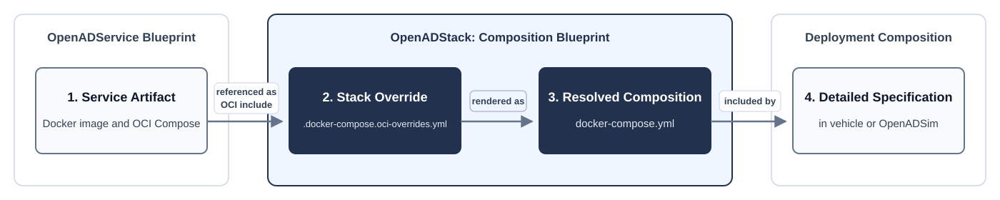

# Integration Architecture

OpenADStack combines independently released OpenADServices into a reusable reference stack. ROS 2 connects the services at runtime, while Docker Compose defines their orchestration and common runtime conventions.

## Architectural Principles

- **ROS 2 interfaces** define the boundaries between OpenADServices.
- **Docker Compose** defines the runtime orchestration by combining and modifying independent released OpenADService blueprint compositions.
- **OpenADStack** assigns stable namespaces, consistent topics, and runtime defaults.

Each OpenADService follows the same artifact flow:



Only the stack override and generated Compose file belong to OpenADStack. The upstream project owns the released service artifacts; a downstream [deployment composition](./deployment-composition.md) selects blueprint compositions and adds vehicle- or simulation-specific configuration.

## Exemplary OpenADService Integration

A new integration defines the service's functional role, stable ROS 2 interfaces, namespace, and runtime requirements. More specifically, a service integration within OpenADStack consists of two adjacent Compose files:

```text
<namespace>/<openadservice>/
├── .docker-compose.oci-overrides.yml
└── docker-compose.yml
```

The override is the manually maintained source of truth, while the generated file resolves the upstream OCI artifact into a Compose definition that deployment compositions can consume directly.

Shared Compose templates apply the common ROS 2 runtime configuration and, where required, enable X11 or GPU access. Each integrated OpenADService extends an appropriate template, documented in the [Compose Service Template Reference](../utils/compose/README.md).

The override can then add or replace stack-specific values such as namespaces and topic mappings. The following `trajectory_optimization` example imports the released OCI artifact, selects the `ros2-service` template, and maps the upstream topic defaults to OpenADStack naming:

```yaml
include:
  - oci://ghcr.io/openads-project/trajectory_optimization:compose-v1.3.0

services:
  trajectory-optimization:
    extends:
      file: ../../utils/compose/docker-compose.template.yml
      service: ros2-service
    environment:
      NAMESPACE: /planning
      EGO_DATA_TOPIC: /localization/ego_state_estimation/ego_data
      OBJECT_LIST_TOPIC: /understanding/lanelet2_object_list_prediction/object_list
      REFERENCE_TRAJECTORY_TOPIC: /planning/simple_planner/trajectory
      ROUTE_TOPIC: /planning/lanelet2_route_planning/route
```

After changing the override, the resolved `docker-compose.yml` can be generated:

```bash
python3 utils/scripts/render_compose_sources.py
```

## Common Runtime Configuration

The Compose templates and OpenADService Compose files expose a small set of consistent runtime variables. Deployment compositions can set these variables without modifying OpenADService launch commands.

| Variable | Defined by | Default | Purpose |
| -------- | ---------- | ------- | ------- |
| `RMW` | Compose templates | `zenoh` | Selects `zenoh`, `fastrtps`, or `cyclone` as the ROS 2 middleware implementation. |
| `ROS_DOMAIN_ID` | Compose templates | `0` | Isolates ROS 2 communication domains on a shared network. |
| `RESTART_POLICY` | Compose templates | `no` | Controls the Docker Compose restart policy. |
| `ZENOH_SESSION_CONFIG_OVERRIDE` | Compose templates | Repository default | Overrides the Zenoh client session configuration. |
| `LOG_LEVEL` | OpenADService Compose files | Usually `info` | Sets the ROS 2 node logging level. |
| `USE_SIM_TIME` | OpenADService Compose files | Usually `false` | Selects wall-clock time or the ROS `/clock` topic. |

Deployment compositions can override these defaults project-wide through a `.env` file or for individual Compose services through the `environment` section. The [demo `.env` file](../demo/.env), for example, enables `USE_SIM_TIME` for all OpenADServices so they consume the published `/clock` topic.
