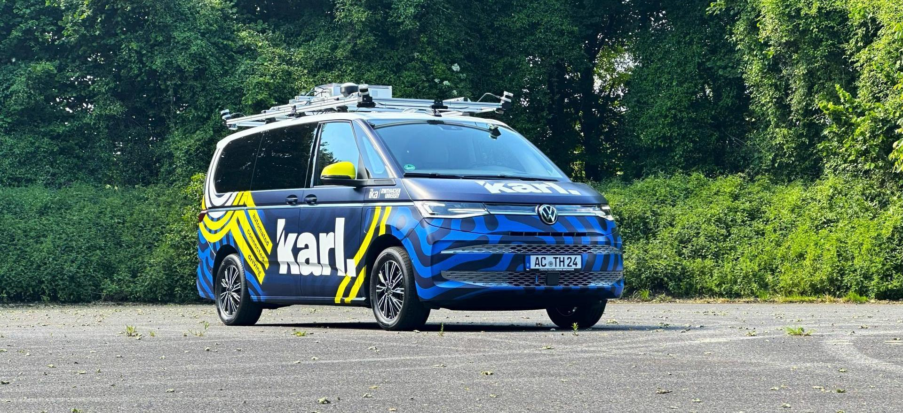

# OpenAD**Stack**

<p align="center">
  <a href="https://github.com/openads-project"></a>
  <a href="https://www.ros.org"></a>
  <a href="https://github.com/openads-project/openadstack/releases/latest"></a>
  <a href="https://github.com/openads-project/openadstack/blob/main/LICENSE"></a>
</p>

**Modular ROS 2 automated-driving stack covering sensing, localization, environment modeling and prediction, planning, optimization, control, and monitoring.**

OpenADStack bundles reusable OpenADS services into a Docker Compose based reference stack. It is designed for different integrations: from real-world automated-driving research with the [karl. research vehicle](https://karl.ac/) to lightweight and repeatable simulation tests in [OpenADSim](https://github.com/openads-project/openadsim).

**🚀 [Quick Start](#-quick-start)** | **🏗️ [Functional Overview & Architecture](#-functional-overview--architecture)** | **📝 [Documentation](#-documentation)** | **🙏 [Acknowledgements](#-acknowledgements)**

> ❗ **Important**
>
> This repository is part of [***OpenADS***](https://github.com/openads-project), the *Open Automated Driving Systems* project. *OpenADS* and its modules have been initiated and are currently being maintained by the [**Institute for Automotive Engineering (ika) at RWTH Aachen University**](https://www.ika.rwth-aachen.de/de/).



## 🚀 Quick Start

Make sure that the general [OpenADS system requirements](https://openads-project.github.io/start/start.html#requirements) are fulfilled.

OpenADStack is usually run as part of an integration, for example with the [karl. research vehicle](https://karl.ac/) or in a simulation setup.

> [!NOTE]
> For closed-loop simulation, scenario execution, maps, and simulator adapters, [OpenADSim](https://github.com/openads-project/openadsim) is the recommended entry point.

For a first local look at OpenADStack itself, use the demo in this repository. It runs the stack open-loop on recorded ROS 2 data, so you can inspect the stack behavior without starting additional simulation or vehicle modules.

Start the open-loop demo:

```bash
cd demo
docker compose up -d
```

Stop the stack again with:

```bash
docker compose down
```

Detailed tutorials and configuration guidance are part of the official [📝 ***OpenADS documentation***](https://openads-project.github.io/openadstack/openadstack.html).

## 🏗️ Functional Overview & Architecture

OpenADStack covers the complete automated-driving processing chain: sensing inputs, localization, environment modeling and prediction, route and trajectory planning, trajectory optimization, vehicle control, and monitoring. The detailed data flow is described in [Functional Architecture](./functional-architecture.md).

OpenADStack is organized into functional domains:

- **Localization**: map serving and ego-state related map context
- **Environment Modeling and Prediction**: object-list processing, scene interpretation, and prediction
- **Planning and Optimization**: route planning, reference generation, and trajectory optimization
- **Control**: trajectory tracking and Ackermann command generation
- **Monitoring**: RViz-based inspection and runtime visualization
- **Middleware**: shared ROS 2 service templates and Zenoh routing

This structure keeps individual services replaceable while preserving stable interfaces between the stack domains.


The technical architecture is based on modular ROS 2 services, shared Docker Compose templates, generated service Compose files, and consistent OpenADS topics. The detailed service structure is described in [Technical Architecture](./technical-architecture.md).

## 📝 Documentation

The documentation contains:

- [Usage](./usage.md)
- [Functional Architecture](./functional-architecture.md)
- [Technical Architecture](./technical-architecture.md)
- [Service Integration](./service-integration.md)

## 🙏 Acknowledgements

### Citation
We hope that OpenADStack can help your research. If this is the case, please cite it using the following metadata.
```
@inproceedings{OpenADStack,
  author = {TODO},
  title = {{OpenADStack}},
  url = {https://github.com/openads-project/openadstack},
  year = {2026},
  doi = {TODO}
}
```

### Related Publications

<details>

<summary><strong>karl. - A Research Vehicle for Automated and Connected Driving, 2026</strong></summary>

> *([IEEEXplore](https://ieeexplore.ieee.org/document/10588502), [arXiv](http://arxiv.org/abs/2404.01836), [ResearchGate](https://www.researchgate.net/publication/379484629_CARLOS_An_Open_Modular_and_Scalable_Simulation_Framework_for_the_Development_and_Testing_of_Software_for_C-ITS))*  
>
> Jean-Pierre Busch, Lukas Ostendorf, Guido Linden, Lennart Reiher, Till Beemelmanns, Bastian Lampe, Timo Woopen, Lutz Eckstein
> [Institute for Automotive Engineering (ika), RWTH Aachen University](https://www.ika.rwth-aachen.de/en/)
>
> <sup>*Abstract* – As highly automated driving is transitioning from single-vehicle closed-access testing to commercial deployments of public ride-hailing in selected areas (e.g., Waymo), automated driving and connected cooperative intelligent transport systems (C-ITS) remain active fields of research. Even though simulation is omnipresent in the development and validation life cycle of automated and connected driving technology, the complex nature of public road traffic and software that masters it still requires real-world integration and testing with actual vehicles. Dedicated vehicles for research and development allow testing and validation of software and hardware components under real-world conditions early on. They also enable collecting and publishing real-world datasets that let others conduct research without vehicle access, and support early demonstration of futuristic use cases. In this paper, we present karl., our new research vehicle for automated and connected driving. Apart from major corporations, few institutions worldwide have access to their own L4-capable research vehicles, restricting their ability to carry out independent research. This paper aims to help bridge that gap by sharing the reasoning, design choices, and technical details that went into making karl. a flexible and powerful platform for research, engineering, and validation in the context of automated and connected driving. More impressions of karl. are available at [https://karl.ac/](https://karl.ac/).</sup>

</details>

### Licensing

The source code in this repository is licensed under Apache-2.0, see [LICENSE](https://github.com/openads-project/openadstack/blob/main/LICENSE). Container images provided by this repository may contain third-party software shipped with their own license terms.

### Funding

Development and maintenance of this repository are supported by the following projects. We acknowledge the funding of the respective institutions.

| Project | Funding Institution | Grant Number |
| --- | --- | --- |
| [AIGGREGATE](https://aiggregate.eu/) | 🇪🇺 European Union | 101202457 |
| [AIthena](https://aithena.eu/) | 🇪🇺 European Union | 101076754 |
| [autotech.agil](https://www.autotechagil.de/) | 🇩🇪 Federal Ministry for Research, Technology and Space (BMFTR) | 01IS22088A |

<p>
  
  
</p>

<sup><sub>Funded by the European Union. Views and opinions expressed are however those of the author(s) only and do not necessarily reflect those of the European Union or the European Climate, Infrastructure and Environment Executive Agency (CINEA). Neither the European Union nor CINEA can be held responsible for them.</sup></sup>
