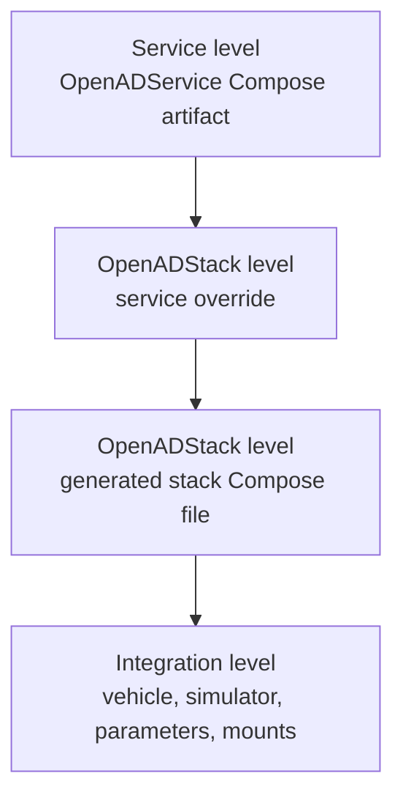

# Technical Architecture

OpenADStack is a Docker Compose based collection of ROS 2 services for automated-driving research and integration. It provides the reusable AD-stack layer of the OpenADS ecosystem. Vehicle, simulator, scenario, and adapter services are provided by integrations such as the [karl. research vehicle](https://karl.ac/) or [OpenADSim](https://github.com/openads-project/openadsim).

## Architectural Principles

- ROS 2 is used as middleware and communication backbone.
- Docker Compose is used for modular service orchestration.
- Services are grouped by automated-driving function: localization, environment modeling and prediction, planning, optimization, control, and monitoring.
- Shared templates keep common container configuration consistent across services.
- Services communicate through stable OpenADS interfaces and topic contracts.
- Individual services can be replaced by custom implementations if they preserve the expected interfaces.

## Service Integration Levels

OpenADStack sits between reusable service releases and concrete deployments. A typical OpenADService already provides a Docker image, a standardized ROS 2 launch file, and a small Compose artifact with node-level defaults. OpenADStack then connects these services into a stack by setting meaningful namespaces, topic names, environment variables, and shared runtime templates for middleware, X11, GPU usage, and similar cross-cutting concerns.

The surrounding levels are important for understanding the full Compose chain, but only levels 2 and 3 are part of OpenADStack itself.



The full chain consists of four levels:

| Level | Ownership | Location | Purpose |
| ----- | --------- | -------- | ------- |
| 1. Service artifact | OpenADService | OCI Compose artifact published by an individual service | Defines the service image, launch command, and module defaults at release time. |
| 2. Stack override | OpenADStack | `.docker-compose.oci-overrides.yml` in each OpenADStack service folder | Connects the service to OpenADStack namespaces, topic names, and default environment variables. |
| 3. Generated stack Compose | OpenADStack | `docker-compose.yml` in each OpenADStack service folder | Resolves the OCI include into a local Compose file so higher-level integrations can use the stack without resolving every service artifact again. |
| 4. Integration override | Integration or deployment | OpenADSim, vehicle setup, or custom deployment | Adds deployment-specific mounts, parameter files, profiles, data sources, gateways, or simulator settings. |

Levels 2 and 3 are the OpenADStack boundary. Level 1 belongs to the individual service repositories. Level 4 belongs to the environment around the stack, such as OpenADSim, a vehicle deployment, or a custom integration.

### Example

At service level, a module usually defines only its own image, launch command, and node-local defaults. Topic environment variables are still generic because the service does not yet know where it will be used:

```yaml
services:
  trajectory-optimization:
    image: ghcr.io/openads-project/trajectory_optimization:v1.2.0
    environment:
      NAMESPACE: /
      NAME: trajectory_optimization
      EGO_DATA_TOPIC: ~/ego_data
      OBJECT_LIST_TOPIC: ~/object_list
      ROUTE_TOPIC: ~/route
      TRAJECTORY_TOPIC: ~/trajectory
    command:
      - /bin/bash
      - -ic
      - |
        ros2 launch trajectory_optimization trajectory_optimization.launch.py \
          namespace:=$${NAMESPACE} \
          name:=$${NAME} \
          ego_data_topic:=$${EGO_DATA_TOPIC} \
          object_list_topic:=$${OBJECT_LIST_TOPIC} \
          route_topic:=$${ROUTE_TOPIC} \
          trajectory_topic:=$${TRAJECTORY_TOPIC}
```

OpenADStack adds stack-level meaning to that service by wiring it to the surrounding stack:

```yaml
include:
  # https://github.com/openads-project/trajectory_optimization/blob/v1.2.0/docker/compose/docker-compose.yml
  - oci://ghcr.io/openads-project/trajectory_optimization:compose-main # TODO: compose-v1.2.0

services:

  trajectory-optimization:
    extends:
      file: ../../docker-compose-essentials/docker-compose.template.yml
      service: ros2-service
    environment:
      # --- name ------
      NAMESPACE: /planning
      # --- inputs ----
      EGO_DATA_TOPIC: /localization/ego_state_estimation/ego_data
      OBJECT_LIST_TOPIC: /understanding/lanelet2_object_list_prediction/predicted_object_list
      REFERENCE_TRAJECTORY_TOPIC: /planning/simple_planner/trajectory
      ROUTE_TOPIC: /planning/lanelet2_route_planning/route
      # --- other -----
      PARAMS: /params.yml
```

This is the core purpose of OpenADStack: it turns reusable OpenADServices into a coherent automated-driving stack by connecting their interfaces and applying shared runtime conventions.

## Shared Service Base

The shared template in `docker-compose-essentials/docker-compose.template.yml` is not an additional integration level. It is a common base that OpenADStack services extend inside levels 2 and 3. The template centralizes runtime settings that should be identical across services:

- ROS 2 and Zenoh-related environment variables
- common container lifecycle settings
- GPU and X11 settings for graphical tools
- workspace and parameter mount conventions

The stack-specific Compose files then focus on module-specific settings such as image tags, launch arguments, namespaces, topic names, and parameter files.

## Middleware

OpenADStack is designed for ROS 2 middleware flexibility. The current Compose setup supports:

- `rmw_fastrtps_cpp`
- `rmw_zenoh_cpp`

The selected middleware is configured through shared environment variables and can be adapted by higher-level integrations. Additional OpenADServices can be connected across middleware boundaries through the [ros_middleware_bridge](https://github.com/openads-project/ros_middleware_bridge) when an integration needs to bridge separate ROS 2 communication domains.

## Tracing

Tracing support is planned as a future extension. The stack already keeps runtime configuration centralized so tracing-related environment variables and mounts can be added consistently across services.
