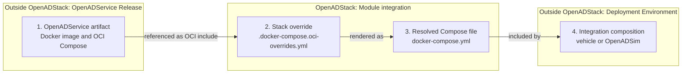

# Technical Architecture

OpenADStack integrates independently released ROS 2 modules into a reusable automated-driving stack. It defines how the modules are connected, but does not contain their source code or a deployment-specific environment. Module development and deployment integration remain separate concerns.

## Architectural Principles

- **ROS 2 provides the communication interfaces between modules**. Well-defined topics, services, and actions define explicit OpenADService boundaries.
- **Docker Compose defines the service orchestration**. It combines the independently released module images, applies environment variables, declares runtime dependencies, and selects required resources such as GPU or X11 access.
- **OpenADStack assigns consistent namespaces, topics, and runtime conventions**. It maps module-local defaults to stable stack interfaces and standardizes settings such as middleware selection or logging.

## OpenADService Integration Boundary

Reusable functional modules generally originate in dedicated OpenADService repositories and follow the [OpenADSuite development and release workflow](https://openads-project.github.io/openadsuite/openadsuite.html). Their release process publishes a container image and an OCI Compose artifact containing the launch command and module-level defaults. OpenADStack imports this artifact and adds the configuration required to connect that single functionality to the rest of the stack.

The following artifact flow describes one OpenADService module, not the complete service composition. The same structure is repeated for modules imported through this workflow.



The OpenADStack boundary lies between the upstream service release and the downstream deployment. The service artifact in stage 1 is maintained by the respective OpenADService. Within OpenADStack, the maintained stack override in stage 2 and the automatically  generated Compose file in stage 3 are stored next to each other and describe the same module integration. The deployment in stage 4 consumes the generated definition and adds environment-specific configuration such as data sources, hardware access, and parameter mounts.

Consequently, only stages 2 and 3 are part of the reference OpenADStack itself. Vehicle deployments and [OpenADSim](https://github.com/openads-project/openadsim) remain outside this boundary. The demo is co-located in this repository for convenience, but has the same architectural role as any other stage 4 integration. The following example applies this structure to a concrete module.

### Example

The `trajectory_optimization` OpenADService publishes its image and Compose artifact independently. Its service-level defaults use module-local topic names because the service does not know the composition in which it will run.

OpenADStack maintains the corresponding stack override in `planning/trajectory_optimization/.docker-compose.oci-overrides.yml`:

```yaml
include:
  - oci://ghcr.io/openads-project/trajectory_optimization:compose-v1.3.0

services:
  trajectory-optimization:
    extends:
      file: ../../utils/compose/docker-compose.template.yml
      service: ros2-service
    environment:
      NAMESPACE: /planning
      EGO_DATA_TOPIC: /localization/ego_state_estimation/ego_data
      OBJECT_LIST_TOPIC: /understanding/lanelet2_object_list_prediction/object_list
      REFERENCE_TRAJECTORY_TOPIC: /planning/simple_planner/trajectory
      ROUTE_TOPIC: /planning/lanelet2_route_planning/route
```

The generator resolves the upstream OCI include and this stack override into the adjacent `planning/trajectory_optimization/docker-compose.yml`. Higher-level compositions include the generated file and could overwrite or add configurations.

## Compose Service Templates

The definitions in `utils/compose/docker-compose.template.yml` centralize recurring container configuration. They are reusable Compose templates within OpenADStack, not an additional integration stage. An OpenADService selects the template that matches its middleware, GPU, and display requirements.

| Definition | Extends | Purpose |
| ---------- | ------- | ------- |
| `base-service` | — | Applies common lifecycle, locale, timezone, and file-limit settings. |
| `x11-service` | `base-service` | Adds X11 display and authorization mounts. |
| `gpu-service` | `base-service` | Adds access to discrete NVIDIA GPUs through Compose device reservations. |
| `nvidia-soc-service` | `base-service` | Adds NVIDIA runtime access for integrated NVIDIA SoCs. |
| `gpu-x11-service` | `gpu-service` | Combines discrete NVIDIA GPU and X11 access. |
| `nvidia-soc-x11-service` | `nvidia-soc-service` | Combines NVIDIA SoC and X11 access. |
| `ros2-service` | Selected `ros2-*-service` | Provides the standard ROS 2 template and selects the RMW implementation through `RMW`. |
| `ros2-zenoh-service` | `base-service` | Configures `rmw_zenoh_cpp` and the default Zenoh router connection. |
| `ros2-fastrtps-service` | `base-service` | Configures `rmw_fastrtps_cpp`. |
| `ros2-cyclone-service` | `base-service` | Configures `rmw_cyclone_cpp`. |
| `ros2-x11-service` | `ros2-service` | Adds X11 access to a ROS 2 service. |
| `ros2-gpu-service` | `ros2-service` | Adds discrete NVIDIA GPU access to a ROS 2 service. |
| `ros2-nvidia-soc-service` | `ros2-service` | Adds NVIDIA SoC runtime access to a ROS 2 service. |
| `ros2-gpu-x11-service` | `ros2-gpu-service` | Combines ROS 2, discrete NVIDIA GPU, and X11 access. |
| `ros2-nvidia-soc-x11-service` | `ros2-nvidia-soc-service` | Combines ROS 2, NVIDIA SoC, and X11 access. |
| `zenoh-router` | `base-service` | Defines the shared Zenoh router used by services running with the Zenoh RMW. |

Most headless OpenADServices extend `ros2-service`. Specialized variants should only be used when a module requires display or accelerator access. `zenoh-router` is a concrete infrastructure service rather than a base template.

`ros2-service` resolves the selected middleware template. For example, `RMW=zenoh` selects `ros2-zenoh-service`, which sets `RMW_IMPLEMENTATION=rmw_zenoh_cpp` and connects to the default Zenoh router. `RMW=fastrtps` and `RMW=cyclone` select the corresponding DDS implementation. The selected RMW implementation must already be installed in the OpenADService container image.

## Common Runtime Configuration

The Compose templates and OpenADService Compose files expose a small set of consistent runtime variables. Deployments can set these variables without modifying module commands.

| Variable | Defined by | Default | Purpose |
| -------- | ---------- | ------- | ------- |
| `RMW` | Compose templates | `zenoh` | Selects `zenoh`, `fastrtps`, or `cyclone` as the ROS 2 middleware implementation. |
| `ROS_DOMAIN_ID` | Compose templates | `0` | Isolates ROS 2 communication domains on a shared network. |
| `RESTART_POLICY` | Compose templates | `no` | Controls the Docker Compose restart policy. |
| `ZENOH_SESSION_CONFIG_OVERRIDE` | Compose templates | Repository default | Overrides the Zenoh client session configuration. |
| `LOG_LEVEL` | OpenADService Compose files | Usually `info` | Sets the ROS 2 node logging level. |
| `USE_SIM_TIME` | OpenADService Compose files | Usually `false` | Selects wall-clock time or the ROS `/clock` topic. |

Deployments can override these defaults project-wide through a `.env` file or for individual services through the Compose `environment` section. The [demo `.env` file](../demo/.env), for example, enables `USE_SIM_TIME` for all OpenADServices so they consume the published `/clock` topic.
