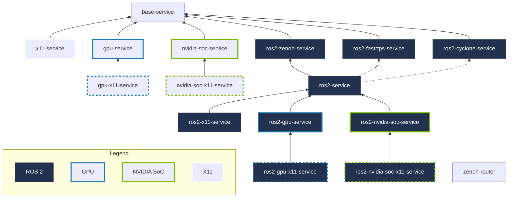

# Compose Service Templates

The definitions in `docker-compose.template.yml` centralize shared lifecycle, middleware, GPU, and display configuration. OpenADServices extend the template that matches their runtime requirements.

| Definition | Extends | Purpose |
| ---------- | ------- | ------- |
| `base-service` | — | Applies common lifecycle, locale, timezone, and file-limit settings. |
| `x11-service` | `base-service` | Adds X11 display and authorization mounts. |
| `gpu-service` | `base-service` | Adds access to discrete NVIDIA GPUs through Compose device reservations. |
| `nvidia-soc-service` | `base-service` | Adds NVIDIA runtime access for integrated NVIDIA SoCs. |
| `gpu-x11-service` | `gpu-service` | Combines discrete NVIDIA GPU and X11 access. |
| `nvidia-soc-x11-service` | `nvidia-soc-service` | Combines NVIDIA SoC and X11 access. |
| `ros2-service` | Selected `ros2-*-service` | Provides the standard ROS 2 Compose service template and selects the RMW implementation through `RMW`. |
| `ros2-zenoh-service` | `base-service` | Configures `rmw_zenoh_cpp` and the default Zenoh router connection. |
| `ros2-fastrtps-service` | `base-service` | Configures `rmw_fastrtps_cpp`. |
| `ros2-cyclone-service` | `base-service` | Configures `rmw_cyclone_cpp`. |
| `ros2-x11-service` | `ros2-service` | Adds X11 access to the `ros2-service` template. |
| `ros2-gpu-service` | `ros2-service` | Adds discrete NVIDIA GPU access to the `ros2-service` template. |
| `ros2-nvidia-soc-service` | `ros2-service` | Adds NVIDIA SoC runtime access to the `ros2-service` template. |
| `ros2-gpu-x11-service` | `ros2-gpu-service` | Combines ROS 2, discrete NVIDIA GPU, and X11 access. |
| `ros2-nvidia-soc-x11-service` | `ros2-nvidia-soc-service` | Combines ROS 2, NVIDIA SoC, and X11 access. |
| `zenoh-router` | `base-service` | Defines the shared Zenoh router used by Compose services running with the Zenoh RMW. |

`ros2-service` selects `zenoh`, `fastrtps`, or `cyclone` through `RMW`. The selected implementation must already be installed in the OpenADService container image. `zenoh-router` is a concrete infrastructure Compose service rather than a base template.

